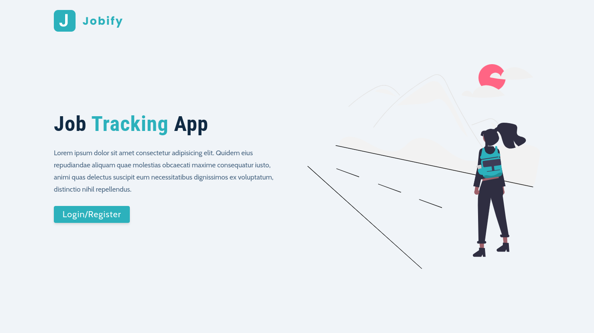
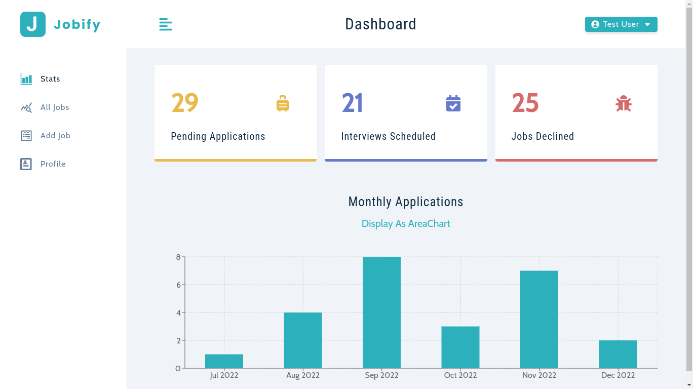

# Jobify (English | Português)

[](https://github.com/KlevertonOliveira/Jobify-MERN/blob/main/license)

---

Table of contents / Índice:

- [Jobify (English | Português)](#jobify-english--português)
  - [:link: Links](#link-links)
  - [:framed_picture: App Demo Images / Imagens de demonstração do App](#framed_picture-app-demo-images--imagens-de-demonstração-do-app)
    - [Landing Page](#landing-page)
    - [Dashboard Page](#dashboard-page)
- [:us: English](#us-english)
  - [:mag_right: About the project](#mag_right-about-the-project)
  - [:medal_military: Features (per page)](#medal_military-features-per-page)
  - [:gear: Technologies Used](#gear-technologies-used)
    - [Frontend](#frontend)
    - [Backend](#backend)
  - [:file_folder: How to run the project](#file_folder-how-to-run-the-project)
  - [:raising_hand_man: Author](#raising_hand_man-author)
- [:brazil: Português](#brazil-português)
  - [:mag_right: Sobre o projeto](#mag_right-sobre-o-projeto)
  - [:medal_military: Funcionalidades (por página)](#medal_military-funcionalidades-por-página)
  - [:gear: Tecnologias Utilizadas](#gear-tecnologias-utilizadas)
    - [Frontend](#frontend-1)
    - [Backend](#backend-1)
  - [:file_folder: Como executar o projeto](#file_folder-como-executar-o-projeto)
  - [:raising_hand_man: Autor](#raising_hand_man-autor)

---

## :link: Links

- [Live Project](https://jobify-dt2w.onrender.com/landing)
  - P.S.: When accessing the app link for the first time, the server will be in an inactive state. Therefore, it is necessary to wait a few moments for the service to be active.
- [Projeto ao vivo](https://jobify-dt2w.onrender.com/landing)
  - OBS.:Ao acessar o link do app pela primeira vez, o servidor estará em estado de inatividade. Por isso, é necessário aguardar alguns instantes para que o serviço esteja ativo.

---

## :framed_picture: App Demo Images / Imagens de demonstração do App

### Landing Page



### Dashboard Page



---

# :us: English

## :mag_right: About the project

Jobify is a Full Stack application developed with the aim of learning more about the MERN stack - MongoDB, Express, React and NodeJS - while providing a conducive environment to put into practice and consolidate the knowledge acquired in web development using these technologies.

The project consists of an application that allows the registered user to manage a list of jobs for which he/she has applied to and perform a series of operations such as: register and update user information; create, edit, search and remove jobs from the list, among many other features that will be better described in the next section.

The application implements authentication and authorization services using JWT, Restful APIs on the server side (Backend) and consumption of these APIs on the client side (Frontend) while creating responsive and fluid interfaces, following programming best practices.

---

## :medal_military: Features (per page)

**Register**:

- User registration;
- Login (user authentication to enter the application), which can be done in two ways:
  - 1 - After the User Registration step, the user provides the previously registered information to request the authentication service;
  - 2 - Select the _Login As Demo User_ option, to log in as a test user, in order to have a demonstration of how the application works and the services offered, but with restricted access;
- **Profile**:
  - Display of user profile information;
  - Editing user profile information (action not available for Test User);
- **Add Job**:
  - Add a new job (action not available for Test User);
- **All Jobs**:
  - Search for jobs registered in the list;
  - Edit job registered in the list (action not available for Test User);
  - Remove job registered in the list (action not available for Test User);
  - Pagination Service to organize the visualization of the complete list of registered jobs.
- **Dashboard / Stats**
  - Display of the total number of registered jobs separated into groups based on the **status** attribute;
  - Graphic display (with two available options: Bar or Area) of the number of jobs monthly applications, taking the last 6 months as a reference period;
- Logout (application exit);

---

## :gear: Technologies Used

### Frontend

- HTML5
- CSS3
- JavaScript ES6
- [TypeScript](https://www.typescriptlang.org/)
- [Axios](https://axios-http.com/docs/intro)
- [React](https://reactjs.org/)
- [React-Router-Dom v6](https://reactrouter.com/docs/en/v6/getting-started/overview)
- [Styled-Components](https://styled-components.com/)
- [Rechats](https://recharts.org/en-US/)
- [Vite](https://vitejs.dev/)

### Backend

- [NodeJS](https://nodejs.org/en/)
- [Express](https://expressjs.com/pt-br/)
- [MongoDB](https://www.mongodb.com)
- [TypeScript](https://www.typescriptlang.org/)
- [JWT](https://jwt.io/)

---

## :file_folder: How to run the project

Prerequisites: node.js, npm

```bash
# Clone repository
git clone https://github.com/KlevertonOliveira/Jobify-MERN.git

# Enter project folder
cd Jobify-MERN/

# Install dependencies
- Backend
npm install

- Frontend
cd client && npm install

# Create a .env file in project's root and fill it following the template in .env.example file

# Run the project (in the root directory of the project!!!)
npm run dev
```

---

## :raising_hand_man: Author

**Kleverton Oliveira**

https://www.linkedin.com/in/klevertonoliveira/

---

---

---

# :brazil: Português

## :mag_right: Sobre o projeto

Jobify é uma aplicação Full Stack desenvolvida com o objetivo de aprender mais sobre a stack MERN - MongoDB, Express, React e NodeJS - ao passo que em fornece um ambiente propício para colocar em prática e consolidar os conhecimentos adquiridos no desenvolvimento web com essas tecnologias.

O projeto consiste em um aplicativo que permite ao usuário cadastrado gerenciar uma lista de empregos para o qual ele(a) se aplicou e realizar uma série de operações como: cadastrar e atualizar de informações do usuário; criar, editar, buscar e remover empregos da lista, dentre muitas outras funcionalidades que serão melhor descritas na seção seguinte.

A aplicação implementa serviços de autenticação e autorização utilizando JWT, Restful APIs no lado do servidor (Backend) e consumo dessas APIs no lado do cliente (Frontend) enquanto cria interfaces responsivas e fluidas, seguindo as melhores práticas de programação.

## :medal_military: Funcionalidades (por página)

- **Register**:
  - Registro de usuário;
  - Login (autenticação de usuário para entrada na aplicação), que pode ser feito de duas maneiras:
    - 1 - Após a etapa de Registro de Usuário, o usuário fornece as informações previamente cadastradas para solicitar o serviço de autenticação;
    - 2 - Selecionar a opção _Login As Demo User_, para efetuar Login como usuário de Teste, com o objetivo de ter uma demonstração do funcionamento da aplicação e os serviços oferecidos, mas com acesso restrito;
- **Profile**:
  - Exibição das informações de perfil do usuário;
  - Edição das informações de perfil do usuário (não é possível para usuário Teste);
- **Add Job**:
  - Adicionar/cadastrar novo emprego (não é possível para usuário Teste);
- **All Jobs**:
  - Buscar emprego cadastrado na lista;
  - Editar emprego cadastrado na lista (não é possível para usuário Teste);
  - Remover emprego cadastrado na lista (não é possível para usuário Teste);
  - Serviço de Paginação para organizar a visualização da lista completa de empregos cadastrados.
- **Dashboard / Stats**
  - Exibição da quantidade total de empregos cadastrados com separação em grupos tomando como base o atributo **status**;
  - Visualização gráfica (com duas opções disponíveis: Barra ou Área) do número de candidaturas mensais a empregos, tendo como período de referência os últimos 6 meses;
- Logout (saída da aplicação);

---

## :gear: Tecnologias Utilizadas

### Frontend

- HTML5
- CSS3
- JavaScript ES6
- [TypeScript](https://www.typescriptlang.org/)
- [Axios](https://axios-http.com/docs/intro)
- [React](https://reactjs.org/)
- [React-Router-Dom v6](https://reactrouter.com/docs/en/v6/getting-started/overview)
- [Styled-Components](https://styled-components.com/)
- [Rechats](https://recharts.org/en-US/)
- [Vite](https://vitejs.dev/)

### Backend

- [NodeJS](https://nodejs.org/en/)
- [Express](https://expressjs.com/pt-br/)
- [MongoDB](https://www.mongodb.com)
- [TypeScript](https://www.typescriptlang.org/)
- [JWT](https://jwt.io/)

---

## :file_folder: Como executar o projeto

Pré-requisitos: node.js, npm

```bash
# Clonar o repositório
git clone https://github.com/KlevertonOliveira/Jobify-MERN.git

# Entrar na pasta do projeto
cd Jobify-MERN/

# Instalar dependências
- Backend
npm install

- Frontend
cd client && npm install

# Criar arquivo .env na raiz do projeto e preenchê-lo seguindo o modelo do arquivo .env.example

# Executar o projeto (estando no diretório raiz do projeto)
npm run dev
```

---

## :raising_hand_man: Autor

**Kleverton Oliveira**

https://www.linkedin.com/in/klevertonoliveira/
